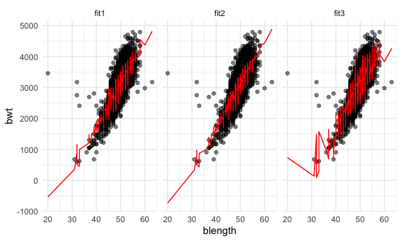
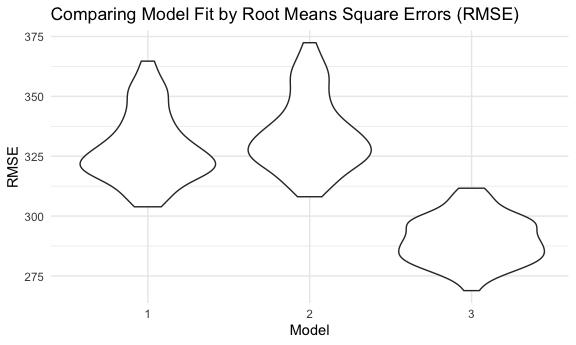

Homework 5
================
Allison Stewart

This is my solution for Homework 6.

## Problem 1

``` r
homicide_df = 
  read_csv("homicide-data.csv", na = c("", "NA", "Unknown")) %>% 
  mutate(
    city_state = str_c(city, state, sep = ", "),
    victim_age = as.numeric(victim_age),
    resolution = case_when(
      disposition == "Closed without arrest" ~ 0,
      disposition == "Open/No arrest"        ~ 0,
      disposition == "Closed by arrest"      ~ 1)
  ) %>% 
  filter(
    victim_race %in% c("White", "Black"),
    city_state != "Tulsa, AL") %>% 
  select(city_state, resolution, victim_age, victim_race, victim_sex)
```

    ## Parsed with column specification:
    ## cols(
    ##   uid = col_character(),
    ##   reported_date = col_double(),
    ##   victim_last = col_character(),
    ##   victim_first = col_character(),
    ##   victim_race = col_character(),
    ##   victim_age = col_double(),
    ##   victim_sex = col_character(),
    ##   city = col_character(),
    ##   state = col_character(),
    ##   lat = col_double(),
    ##   lon = col_double(),
    ##   disposition = col_character()
    ## )

Fit a logistic regression with resolved vs unresolved as the outcome and
victim age, sex and race as predictors.

``` r
baltimore_df =
  homicide_df %>% 
  filter(city_state == "Baltimore, MD")

glm(resolution ~ victim_age + victim_race + victim_sex, 
    data = baltimore_df,
    family = binomial()) %>% 
  broom::tidy() %>% 
  mutate(
    OR = exp(estimate),
    CI_lower = exp(estimate - 1.96 * std.error),
    CI_upper = exp(estimate + 1.96 * std.error)
  ) %>% 
  select(term, OR, starts_with("CI")) %>% 
  knitr::kable(digits = 3)
```

| term              |    OR | CI\_lower | CI\_upper |
| :---------------- | ----: | --------: | --------: |
| (Intercept)       | 1.363 |     0.975 |     1.907 |
| victim\_age       | 0.993 |     0.987 |     1.000 |
| victim\_raceWhite | 2.320 |     1.648 |     3.268 |
| victim\_sexMale   | 0.426 |     0.325 |     0.558 |

Run glm for each of the cities.

``` r
models_results_df = 
  homicide_df %>% 
  nest(data = -city_state) %>% 
  mutate(
    models = 
      map(.x = data, ~glm(resolution ~ victim_age + victim_race + victim_sex, data = .x, family = binomial())),
    results = map(models, broom::tidy)
  ) %>% 
  select(city_state, results) %>% 
  unnest(results) %>% 
  mutate(
    OR = exp(estimate),
    CI_lower = exp(estimate - 1.96 * std.error),
    CI_upper = exp(estimate + 1.96 * std.error)
  ) %>% 
  select(city_state, term, OR, starts_with("CI")) 
```

Create a plot that shows estimated ORs and CIs for each city.

``` r
models_results_df %>% 
  filter(term == "victim_sexMale") %>% 
  mutate(city_state = fct_reorder(city_state, OR)) %>% 
  ggplot(aes(x = city_state, y = OR)) + 
  geom_point() + 
  geom_errorbar(aes(ymin = CI_lower, ymax = CI_upper)) + 
  theme(axis.text.x = element_text(angle = 90, hjust = 1))
```


# Problem 2

Import and clean data.

``` r
baby_df = 
  read_csv("birthweight.csv") %>%
  mutate(
    babysex = as.factor(babysex), 
    frace = as.factor(frace), 
    mrace = as.factor(mrace)) 
```

    ## Parsed with column specification:
    ## cols(
    ##   .default = col_double()
    ## )

    ## See spec(...) for full column specifications.

``` r
summarize(baby_df, count = sum(is.na(baby_df)))
```

    ## # A tibble: 1 x 1
    ##   count
    ##   <int>
    ## 1     0

Propose a regression model for birthweight.

``` r
model_fit = lm(bwt ~ gaweeks +  blength + delwt + smoken, data = baby_df) 

model_fit %>% 
  broom::tidy() %>% 
  select(term, estimate, p.value) %>% 
  mutate(term = str_replace(term, "\\(Intercept\\)","intercept")) %>% 
  knitr::kable(digits = 3)
```

| term      |   estimate | p.value |
| :-------- | ---------: | ------: |
| intercept | \-4444.687 |       0 |
| gaweeks   |     26.605 |       0 |
| blength   |    123.029 |       0 |
| delwt     |      2.762 |       0 |
| smoken    |    \-3.073 |       0 |

Based on hypothesized variables that influenced babyweight, I included
the following variables in a linear regression model: mother’s weight at
delivery (delwt), gestational age in weeks (gaweeks), baby’s length at
birth (blength), and average number cigarettes smoked per day during
pregnancy (smoken). The following plot shows the residuals of the model
plotted against the fitted values.

``` r
baby_df %>% 
  add_residuals(model_fit) %>% 
  add_predictions(model_fit) %>% 
  select(resid, pred, delwt, gaweeks, smoken, blength) %>% 
  ggplot(aes(x = pred, y = resid)) + 
  geom_point(alpha = 0.5) + 
  labs(
    title = "Residuals vs. Fitted Predictions", 
    x = "Fitted Prediction", 
    y = "Residuals"
  )
```


Compare the model to two others in terms of cross-validation prediction
error.

``` r
fit1 = model_fit 
  
fit2 = lm(bwt ~ gaweeks + blength, data = baby_df) 

fit3 = lm(bwt ~ bhead + blength + babysex + bhead * blength + bhead * babysex + blength * babysex, data = baby_df)

baby_df %>% 
  gather_predictions(fit1, fit2, fit3) %>% 
  mutate(model = fct_inorder(model)) %>% 
  ggplot(aes(x = blength, y = bwt)) + 
  geom_point(alpha = .5) +
  geom_line(aes(y = pred), color = "red") + 
  facet_grid(~model)
```



``` r
cv_df =
  crossv_mc(baby_df, 100) %>% 
  mutate(
    train = map(train, as_tibble),
    test = map(test, as_tibble))

cv_df = 
  cv_df %>% 
  mutate(
    fit1 = map(train, ~lm(bwt ~ gaweeks +  blength + delwt + smoken, data = .x)),
    fit2 = map(train, ~lm(bwt ~ gaweeks + blength, data = .x)),
    fit3 = map(train, ~gam(bwt ~ bhead + blength + babysex + bhead * blength + bhead * babysex + blength * babysex, data = as_tibble(.x)))) %>% 
  mutate(
    rmse_1 = map2_dbl(fit1, test, ~rmse(model = .x, data = .y)),
    rmse_2 = map2_dbl(fit2, test, ~rmse(model = .x, data = .y)),
    rmse_3 = map2_dbl(fit3, test, ~rmse(model = .x, data = .y)))

cv_df %>% 
  select(starts_with("rmse")) %>% 
  pivot_longer(
    everything(),
    names_to = "model", 
    values_to = "rmse",
    names_prefix = "rmse_") %>% 
  mutate(model = fct_inorder(model)) %>% 
  ggplot(aes(x = model, y = rmse)) + geom_violin() + 
  labs(
    title = "Comparing Model Fit by Root Means Square Errors(RMSE)", 
    x = "Model", 
    y = "RMSE"
  )
```



The plotted Root Means Square Errors (RMSE) for each model indicates
that Model 3, the linear model containing head circumference, length,
sex, and all interactions between the three variables produces the best
fit. The significantly lower RMSE values of this model indicates a
better fit. Models 1 and 2 produce fairly similar RMSE distributions and
are worse in predictive accuracy as compared to Model 3.

# Problem 3
